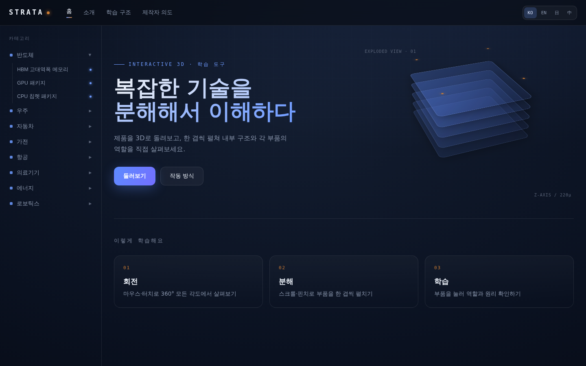
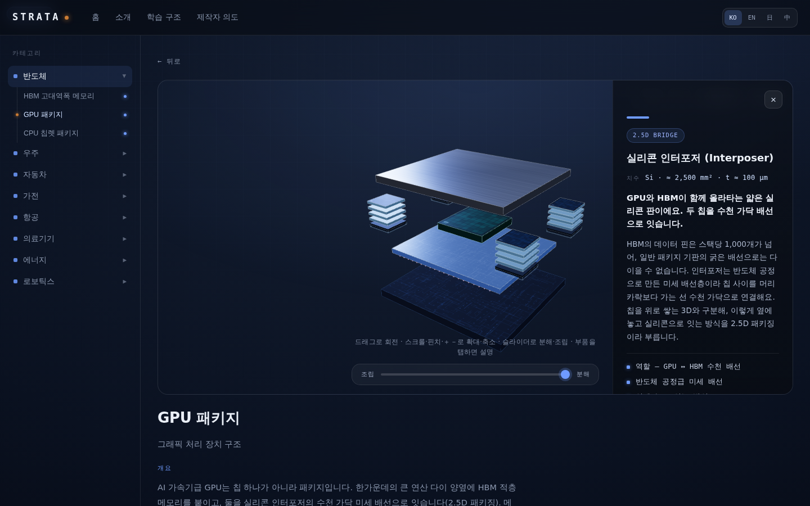
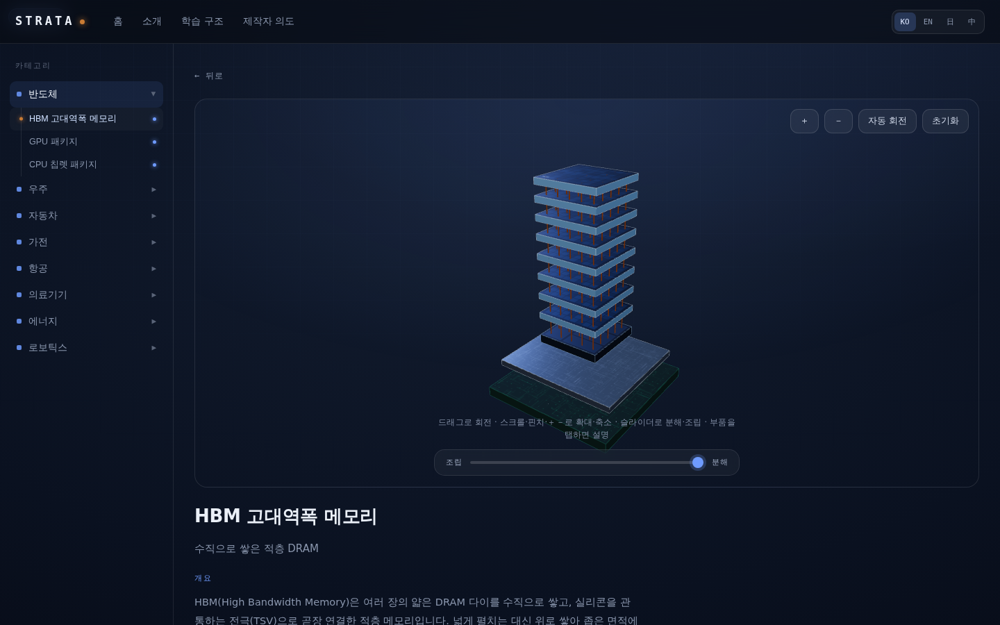
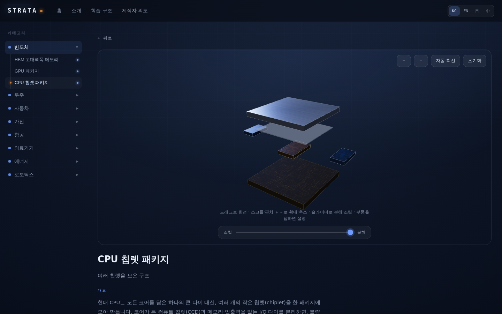

# STRATA — 3D Learning Simulator

> An educational website for exploring complex technical products through **3D exploded views**.
> Rotate the product, expand (explode) and collapse (assemble) parts with scroll/pinch/slider, and click any part to see an explanation of its role.
> **STRATA** is a placeholder brand name. It can be changed in one place: [`shared/config.ts`](shared/config.ts).

🟢 **Live**: **<https://3d-simulator-rouge.vercel.app>** — deployed on Vercel, auto-updated on every push to `main`.

## Preview

| Home | GPU Package — Exploded + Info Panel |
| --- | --- |
| [](docs/screenshots/home.png) | [](docs/screenshots/gpu-exploded-panel.png) |

| HBM — Vertical Stack Exploded | CPU — Chiplet Planar Exploded |
| --- | --- |
| [](docs/screenshots/hbm-exploded.png) | [](docs/screenshots/cpu-exploded.png) |

---

## Core Concept


Every model follows the same **three-step flow**:

1. **Rotate** — observe from any angle across 360° using mouse, touch, or arrow keys
2. **Explode** — spread parts apart layer by layer with the bottom slider (independent of zoom)
3. **Learn** — click a part to see its role, dimensions, and how it works

The site launches with 8 categories (Semiconductor · Space · Automotive · Appliance · Aviation · Medical Device · Energy · Robotics), with more categories and models to come. Multi-language support (**KO / EN / 日 / 中**) is built in.

## Models Currently Available — 11


### Semiconductor — Stacking · Packaging · Chiplets


| Model | Folder | What it shows |
| --- | --- | --- |
| **HBM (High Bandwidth Memory)** | [`semiconductor/hbm/`](semiconductor/hbm) | 8-layer vertical DRAM stack + through-silicon vias (TSV) — "why do we stack it" |
| **GPU Package** | [`semiconductor/gpu/`](semiconductor/gpu) | Compute die + 4× HBM in a 2.5D package — "why do we place it side by side" |
| **CPU Chiplet Package** | [`semiconductor/cpu/`](semiconductor/cpu) | Chiplet-split architecture — "why do we split it" |

### Space — Launch → Orbit → Return


| Model | Folder | What it shows |
| --- | --- | --- |
| **Rocket Engine** | [`space/rocket-engine/`](space/rocket-engine) | Liquid-fuel engine (gas generator cycle · LOX/RP-1) — how thrust is generated |
| **Earth Observation Satellite** | [`space/eo-satellite/`](space/eo-satellite) | LEO bus + observation camera — power, attitude, comms, propulsion, thermal |
| **Communications Satellite** | [`space/comsat/`](space/comsat) | GEO bus + transponder/reflector — **shares the same bus core** as the observation satellite |
| **Reentry Capsule** | [`space/reentry-capsule/`](space/reentry-capsule) | Blunt cone + ablative heat shield — how it returns without burning up |

### Automotive — Store → Drive → Prepare


| Model | Folder | What it shows |
| --- | --- | --- |
| **EV Battery Pack** | [`automotive/ev-battery/`](automotive/ev-battery) | Cell → module → pack, 3-tier hierarchy + cell-format options (prismatic/cylindrical/pouch) |
| **Drive Motor** | [`automotive/drive-motor/`](automotive/drive-motor) | PMSM (IPM V-shaped magnets) — the rotor actually spins during auto-rotate |
| **Internal Combustion Engine** | [`automotive/combustion-engine/`](automotive/combustion-engine) | 4-stroke cycle + crank phase — a cutaway view of the piston inside the bore |

### Robotics — Move · Sense

| Model | Folder | What it shows |
| --- | --- | --- |
| **Robotic Actuator** | [`robotics/actuator/`](robotics/actuator) | Integrated joint module (frameless BLDC + strain wave gear) — how fast motor spin becomes precise, high torque |

For detailed structure and part descriptions, see the README / CLAUDE.md inside each model folder.

---

## Tech Stack


- **Build**: [Vite](https://vitejs.dev/) + TypeScript
- **UI**: [React](https://react.dev/) + [zustand](https://zustand.docs.pmnd.rs/) for global state
- **3D**: [React Three Fiber](https://r3f.docs.pmnd.rs/) + [@react-three/drei](https://drei.docs.pmnd.rs/) (engine is Three.js)
- **Styling**: Plain CSS + design tokens (CSS variables) — no UI framework
- **i18n**: Lightweight in-house i18n (key-value dictionaries in `locales/`, Korean is the type source of truth)
- **Deployment**: [Vercel](https://vercel.com/) — connected to GitHub, auto build/deploy on push to `main` ([`vercel.json`](vercel.json))

## Getting Started


```
npm install      # install dependencies
npm run dev      # dev server (HMR)
npm run build    # typecheck (tsc) + production bundle
npm run preview  # preview the production build
```

Append `?stats` to any model screen URL to show an FPS overlay (stats.js) for performance checks.

---

## Project Structure


```
3d-simulator/
  index.html                 # Vite entry point
  src/
    main.tsx                 # bootstrap
    App.tsx                  # app shell: top nav + 2-level sidebar + content routing
    shared/
      r3f/                   # shared 3D engine
        Viewer.tsx           #   <Viewer> — Canvas, on-demand rendering, viewer chrome
        SceneContents.tsx    #   explode interpolation, camera framing, input (drag/pinch/keyboard), picking
        model.ts             #   model contract (ModelDef) type
        registry.tsx         #   "category/model" → lazy viewer (registering a new model = one line)
        textures.ts          #   shared procedural textures (cached per parameter set)
      ui/                    # nav, sidebar, info panel, viewer controls (React)
      state/                 # zustand stores (language, explode value, selection, zoom) + routing
    index.css                # shell-level auxiliary styles
  shared/
    config.ts                # single source of truth for the brand name
    catalog.ts                # category + model catalog (name/overview/specs, multi-language)
    styles/                  # design tokens + shell/viewer CSS
    scene/ interaction/ …    # (legacy) vanilla Three.js-era code — unused now
  locales/                   # dictionaries: ko / en / ja / zh
  pages/                     # content guidelines for shared pages (About · Learning structure · Creator's intent)
  semiconductor/             # ── category (README + CLAUDE.md)
    hbm/  gpu/  cpu/         #     ── models: model.tsx (geometry) + data.ts (part descriptions)
  space/                     # ── category
    rocket-engine/           #     rocket engine
    satellite/               #     shared satellite core (parts.tsx · info.ts — not a model itself)
    eo-satellite/ comsat/    #     2 satellite models (share the core)
    reentry-capsule/         #     reentry capsule
  automotive/               # ── category
    ev-battery/  drive-motor/  combustion-engine/
  robotics/                 # ── category
    actuator/                 #     robotic actuator (harmonic drive joint)
  appliance/ aviation/ medical/ energy/  # (planned)

```

Each folder contains two kinds of docs:

- **`README.md`** — human-facing explanation (what this folder is and how it works).
- **`CLAUDE.md`** — AI collaboration guidance (read root → category → model, with specificity/priority increasing further down).

---

## Architecture — Shared vs. Model-Specific


Core principle: **the only thing that differs between models is geometry and descriptions — everything else is shared.**

Each model provides just two files — `model.tsx` (3D geometry) and `data.ts` (multi-language part descriptions). Rotation, zoom, explode, selection, the info panel, and the environment map are all handled by the shared engine, [`<Viewer>`](src/shared/r3f/Viewer.tsx).

```
// src/shared/r3f/model.ts — model contract
interface ModelDef {
  parts: PartDef[];   // { id, base, explode, order?, layer?, node }
  info: PartInfoMap;  // part id → multi-language description (tag·title·spec·lead·detail·facts·sources)
  extras?: ReactNode; // meshes unrelated to the explode (e.g. HBM's TSVs)
  options?: ModelOption[]; // model options — toggles in the viewer's top-left corner (e.g. HBM layer count, cutaway)
  update?: (ctx) => void;  // per-frame update — ctx provides t · dt · autoRotate · options
}
```

Each part's position is interpolated from `base → base + explode` based on the explode value `t`, staggered via `order`. Simply changing the explode vector expresses **vertical stacking** (HBM), **planar layout** (CPU), **axial** (motor), **concentric shells** (capsule), or any mix of these.

What the engine additionally provides:

- **Model options** — declaring `options` alone adds toggle UI in the viewer's top-left corner (e.g. HBM layer count 8/12/16-Hi, battery cell format). Hidden parts are automatically excluded from clicking and camera framing.
- **Motion staging** — `update` receives `dt` and `autoRotate`, so the mechanism actually moves during auto-rotate (motor rotor spinning, engine crank/piston 4-stroke cycle).
- **Cutaway views** — a shared helper ([`cutaway.ts`](src/shared/r3f/cutaway.ts)) provides cross-section views (HBM TSV cross-section, engine bore, motor IPM magnets).

**Adding a new model** (3 places):

1. Write `model.tsx` + `data.ts` inside `<category>/<model>/`
2. Add one lazy-loaded entry to [`src/shared/r3f/registry.tsx`](src/shared/r3f/registry.tsx)
3. Add one card-metadata entry (name/overview/specs) to [`shared/catalog.ts`](shared/catalog.ts)

Three.js and the viewer are lazy-loaded only when a model is opened, so they're excluded from the home/content screen bundles.

---

## Performance / Accessibility


- **On-demand rendering** — `frameloop="demand"`: only redraws when the screen actually changes (zero GPU usage while idle).
- **Lazy loading** — the 3D bundle (three ≈184kB gzip) loads only on model screens. Each model chunk is ≈4–14kB gzip (satellites sharing the core are even smaller).
- **Instancing** — repeated elements (BGA balls, bumps, TSVs, solar cells, RCS nozzles) use `InstancedMesh`.
- **Texture budget** — procedural textures are generated once per parameter set and shared via a cache.
- **Motion accessibility** — transition animations and auto-rotate are disabled under `prefers-reduced-motion`.
- **Keyboard/screen reader** — canvas focus + arrow-key rotation, `:focus-visible` focus rings, ARIA labels on controls (multi-language).

See [`src/shared/CLAUDE.md`](src/shared/CLAUDE.md) for the performance budget table and measurement procedure.

## Internationalization (i18n)


- Site-wide copy → `locales/{ko,en,ja,zh}.ts` — Korean is the source-of-truth type (`Dict`); missing keys are caught at compile time.
- Model part descriptions → co-located in each model's `data.ts`. Model overview/specs → `shared/catalog.ts`.
- All user-facing text lives behind translation keys; nothing is hardcoded.

## Design Direction


A restrained, dark tech aesthetic evoking a precision instrument.

- **Background**: near-black navy radial gradient
- **Accent colors**: blue `#6f9bff` · copper `#c97b34` · gold `#e6b53c`
- **UI**: translucent glass panels, thin borders. **Typography**: monospace for headings/numbers, sans-serif for body text

Shared colors and fonts are managed as CSS variables in [`shared/styles/tokens.css`](shared/styles/tokens.css).

---

## Progress


- [x] **1–2. Setup** — Vite + TS → migrated to React/R3F/drei/zustand
- [x] **3. App shell + i18n** — nav, 2-level sidebar, shared pages, i18n
- [x] **4. Shared 3D engine** — `<Viewer>` contract, explode, picking, on-demand rendering
- [x] **5. HBM** — ported the vanilla prototype (`hbm-3d-space.html`) to R3F (quality baseline)
- [x] **6. CPU / GPU** — validated engine generalization with planar/mixed explode directions
- [x] **7. Performance pass + accessibility** — texture caching, measurement tooling, reduced-motion, keyboard, ARIA
- [x] **8. Site polish** — shared page content · web fonts · state design · meta/OG (Lighthouse 95/100/100/100)
- [x] **9. Deployment** — connected to Vercel, auto-deploy on push to `main`, finalized og:url/canonical
- [x] **Space category** — rocket engine · Earth-observation/comm satellites (shared core) · reentry capsule (launch → orbit → return)
- [x] **Automotive category** — EV battery · drive motor · internal combustion engine (store → drive → prepare)
- [x] **Model enrichment round** — sources ("read more") for every part · motion staging (motor, engine 4-stroke) · model options (HBM layer count/cutaway, GPU stack count, battery cell format) · shared cutaway implementation
- [x] **Robotics category (started)** — robotic actuator: harmonic-drive joint module, axial explode + reduction-motion staging + cutaway
- [ ] Next — expand categories (Aviation, Appliance, Medical, Energy) and Robotics (humanoid hand, LiDAR); migrate to Astro if needed + SEO/analytics

## Creator


Built in Toronto, from a simple belief: understanding comes faster when you open something up and look inside for yourself.
